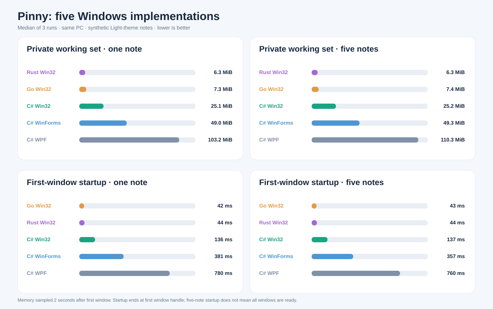

# Pinny UI benchmark



[PNG chart](benchmark.png) · [SVG chart](benchmark.svg) · [All 30 measurements](results.csv)

Five Windows x64 implementations were measured on the same PC with one and five synthetic notes. Values below are medians of three sequential runs. Lower is better for memory and startup; each chart panel is sorted from lowest to highest. The active app under `Pinny/` is not measured; these builds live under `Experiments/`.

| Implementation | Private working set, 1 note | Private working set, 5 notes | First-window startup, 1 note | First-window startup, 5 notes |
| --- | ---: | ---: | ---: | ---: |
| C# / .NET 8 WPF | 103.2 MiB | 110.3 MiB | 780 ms | 760 ms |
| C# / .NET 8 WinForms | 49.0 MiB | 49.3 MiB | 381 ms | 357 ms |
| C# / .NET 8 Win32 | 25.1 MiB | 25.2 MiB | 136 ms | 137 ms |
| Rust Win32 | 6.3 MiB | 6.3 MiB | 44 ms | 44 ms |
| Go Win32 | 7.3 MiB | 7.4 MiB | 42 ms | 43 ms |

Rust has the lowest measured private working set. Rust and Go are close on first-window startup; the 20 ms polling interval and three-run sample cannot establish a meaningful difference between them. For one note, median private bytes are 8.3 MiB for Rust and 19.5 MiB for Go. These are results for these particular builds, not general language or framework performance claims.

## Test setup and limits

- **Recorded:** 27 September 2026 on Windows x64, OS build 26200.
- **Builds:** The C# projects use .NET 8 Release, self-contained, single-file, compressed executables and the regular .NET runtime. Native AOT was not measured. Rust and Go use Release native Windows GUI executables.
- **Notes:** One or five synthetic Light-theme notes, each 320 × 320 pixels with two short lines of text. No personal note data was used.
- **Runs:** Three per implementation and note count, run sequentially. The table and chart show medians.
- **RAM:** Windows `Process\Working Set - Private`, sampled two seconds after the first window appeared. One MiB is 1,048,576 bytes. The CSV's `MB` columns use that binary unit. This process metric excludes some desktop compositor and GPU memory.
- **Startup:** Elapsed time from process launch until the first visible Pinny note window appeared, polled every 20 ms. This is a warm-cache measurement. For five notes, it does not indicate when all five windows are ready.
- **Idle CPU:** Process CPU time during the following three seconds is in the CSV. That short window is noisy and cannot establish sustained idle behavior.

The C# and Go builds load synthetic notes from isolated JSON folders. Rust constructs equivalent notes in memory because it has no persistence. This input-path difference matters when interpreting startup. The Win32 UIs are similar but not byte-for-byte identical; WPF and WinForms use different rendering and controls. Note content, themes, display scale, OS state, and other processes can change results. The benchmark measures runtime cost, not whether an implementation is ready to replace the active WPF app.

## Build and rerun

On Windows x64, install the .NET 8 SDK, Go for Windows x64, and Rust with Cargo and the `stable-x86_64-pc-windows-gnu` toolchain. The Rust project pins `windows-sys` 0.59.0 and builds with Rust's bundled GNU linker, so Visual Studio Build Tools are not required. From the repository root in PowerShell:

```powershell
.\Benchmarks\Publish-Baseline.ps1
.\Benchmarks\Build-Native.ps1
.\Benchmarks\Measure-Pinny.ps1
```

The publish script builds the three C# executables under `dist\baseline-2026-09-27\`. The native build script writes `dist\native\Pinny.Rust.exe` and `Pinny.Go.exe`, including the app icon. The measurement script runs all five builds, writes [results.csv](results.csv), and regenerates [benchmark.svg](benchmark.svg) and [benchmark.png](benchmark.png). It uses isolated synthetic note folders under `Benchmarks\.data` and stops only processes it launches. The published executables and synthetic folders are ignored by Git; the CSV and charts are the single tracked benchmark result.

The benchmark can also be run with different `-Repetitions`, `-NoteCounts`, `-SettleSeconds`, and `-CpuSeconds` arguments. Chart generation requires both one-note and five-note measurements.

## Rust and Go Win32 experiments

`Experiments/Pinny.Rust/` and `Experiments/Pinny.Go/` reproduce the C# Win32 window with direct Win32 calls. They use the same note dimensions, two-line benchmark text, positions, three palettes, Segoe UI font, native multiline EDIT control, custom header, resize edges, New/Menu/Pin/Close controls, and Quit menu item. Both are independent Windows x64 GUI executables. Rust keeps notes only in memory. Go saves `notes.json` by default under `%LOCALAPPDATA%\Pinny.Go\` and accepts `--data-dir FOLDER` for another location. Go uses the C# note JSON fields, saves after 500 ms of inactivity, and saves on Quit. The Close button deletes that note; Quit keeps all open notes. Neither implements networking, sync, or a tray icon.

Run either executable after building it:

```powershell
.\dist\native\Pinny.Rust.exe --notes 1
.\dist\native\Pinny.Go.exe
.\dist\native\Pinny.Go.exe --data-dir C:\Notes\Pinny-Go
```

Rust launches with one blank note by default; `--notes COUNT` creates COUNT synthetic notes in memory (1 to 100). Go loads saved notes by default, or creates one blank note if none are saved. Go's `--notes COUNT` remains an explicitly in-memory synthetic mode for comparison; it does not read or write the normal note file. Do not point Go and another Pinny process at the same data folder simultaneously: the JSON store does not merge concurrent edits. The projects have no shared runtime code.
