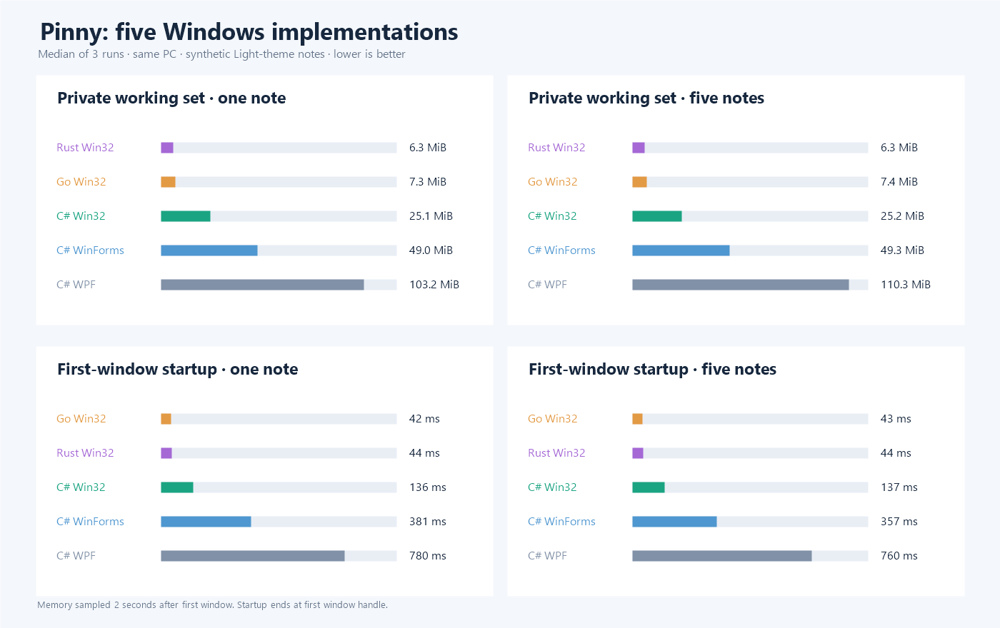

# Pinny

Pinny is a small Windows desktop notes app built with C#, .NET 8, and WPF. It uses local JSON files, with no database, web view, local server, or background service.

`Pinny/` is the WPF app for ongoing development. `Experiments/` contains frozen C# WPF, WinForms, and Win32 comparisons, plus independent Rust and Go Win32 experiments. The UI technology decision is still open; see [technical notes and decisions](TECHNICAL.md).

## Use the app

On Windows x64, double-click `dist\Pinny.exe` after publishing it. This self-contained build includes the .NET runtime and needs no console or separate .NET installation.

- Type directly into any note. Each note has its own text, position, size, pin state, and theme.
- Click **+** to create another note. New notes open slightly offset from the current one.
- Drag a note's header to move it; drag an edge or corner to resize it.
- Click **Menu** to choose Light, Dark, or Paper, or to **Quit Pinny** while keeping all notes.
- Click the diamond to toggle always-on-top for that note.
- Click **×** (or close that window from the taskbar) to delete only that note. Deleting the last note exits Pinny; the next launch starts with a blank note.

Pinny saves all notes to `%LOCALAPPDATA%\Pinny\notes.json`. Changes save 500 ms after the last edit, move, resize, pin toggle, or theme change, and again when quitting. When upgrading from the single-note version, Pinny loads the old `%LOCALAPPDATA%\Pinny\note.json` if `notes.json` does not exist. The old file is left in place as a backup. If a saved position is off-screen after a monitor change, Pinny moves that window back into view.

### Choose a notes folder

The active WPF app can use a different folder for `notes.json`. Set the `PINNY_DATA_DIR` user environment variable to a folder path if you want the choice to apply when double-clicking Pinny, or pass `--data-dir <folder>` for one launch. The command-line option takes precedence. No `.env` file is required or read by the app.

In PowerShell, `$env:PINNY_DATA_DIR = 'C:\Notes\Pinny'` sets it for the current session. Then run `dotnet run --project .\Pinny\Pinny.csproj`.

The app does not move existing notes when you change folders. Close Pinny, copy the existing `notes.json` to the new folder if you want to retain those notes, then launch it with the new setting. Keep only one running app pointed at a notes folder: the current JSON storage does not merge simultaneous edits. The archived builds under `Experiments/` keep their own default folders and ignore `PINNY_DATA_DIR`.

## Requirements

- **Run:** Windows 10 or 11, x64. The published executable includes the .NET runtime.
- **Build:** .NET 8 SDK. Windows is required to run or visually test any version. The WPF source can also be compiled on Linux or macOS with Windows targeting enabled; build the comparison projects on Windows.
- **First build on Linux/macOS:** Internet access may be needed to download Windows targeting packs. The project sets `EnableWindowsTargeting` for this purpose.
- **Native AOT (optional, not used by the current builds):** Publishing the Win32 experiment with AOT on Windows also requires the Visual Studio Desktop development with C++ workload.

## Build from source

From the repository root, run:

```sh
dotnet build Pinny/Pinny.csproj -c Release
```

On Windows, run a development build with:

```powershell
dotnet run --project .\Pinny\Pinny.csproj
```

To publish a standalone Windows x64 executable, run this on Windows:

```powershell
dotnet publish .\Pinny\Pinny.csproj -c Release -r win-x64 --self-contained true -p:PublishSingleFile=true -p:IncludeNativeLibrariesForSelfExtract=true -p:EnableCompressionInSingleFile=true -p:DebugType=none -p:DebugSymbols=false -o .\dist
```

The output is `dist\Pinny.exe`. `bin`, `obj`, and `dist` are ignored by Git. A GitHub source checkout will not contain the executable; attach it to a GitHub Release if you want others to download it without building.

## Project layout

- `Pinny/App.xaml.cs`: creates note windows and coordinates save, delete, and quit.
- `Pinny/MainWindow.xaml` and its code-behind: note UI, themes, and one-shot save debounce.
- `Pinny/NoteState.cs`: fields stored for each note.
- `Pinny/NoteStorage.cs`: local JSON read, write, and single-note migration.
- `Pinny/Assets`: app icon.
- `Experiments/Pinny.WpfBaseline/`, `Pinny.WinForms/`, `Pinny.Win32/`: three standalone source snapshots of the simple app.
- `Experiments/Pinny.Rust/` and `Pinny.Go/`: standalone native Win32 comparisons; Rust is in-memory, while Go saves local JSON. See [build and benchmark commands](Benchmarks/README.md#rust-and-go-win32-experiments).
- `Experiments/Baseline/`: model and storage source shared only by those snapshots; see [experiment structure](Experiments/README.md).
- `Benchmarks/`: five-build comparison and scripts to build and measure the experiments.
- `TECHNICAL.md`: architecture, current technical decisions, and checks before selecting a UI.

## Performance experiments

The benchmark compares the five simple builds under `Experiments/`. It does not measure future changes to the active WPF app under `Pinny/`.



[Benchmark methods and results](Benchmarks/README.md) · [All 30 raw measurements](Benchmarks/results.csv)

With one synthetic note, median private working set was 103.2 MiB for C# WPF, 49.0 MiB for C# WinForms, 25.1 MiB for C# Win32, 6.3 MiB for Rust Win32, and 7.3 MiB for Go Win32. First-window startup was 780, 381, 136, 44, and 42 ms respectively. Rust keeps notes in memory; Go loads and saves the same JSON note format as the C# builds.

| Version | Interface | Note storage | Open after publishing |
| --- | --- | --- | --- |
| WPF baseline | Borderless WPF window | `%LOCALAPPDATA%\Pinny.Baseline\Wpf\notes.json` | `dist\baseline-2026-09-27\wpf\Pinny.exe` |
| WinForms baseline | Borderless Windows Forms window | `%LOCALAPPDATA%\Pinny.Baseline\WinForms\notes.json` | `dist\baseline-2026-09-27\winforms\Pinny.WinForms.exe` |
| Win32 baseline | Borderless note window with a painted header and native edit control | `%LOCALAPPDATA%\Pinny.Baseline\Win32\notes.json` | `dist\baseline-2026-09-27\win32\Pinny.Win32.exe` |
| Rust Win32 | Painted Win32 window and native edit control | None | `dist\native\Pinny.Rust.exe` |
| Go Win32 | Painted Win32 window and native edit control | `%LOCALAPPDATA%\Pinny.Go\notes.json` | `dist\native\Pinny.Go.exe` |

All three snapshots can open multiple notes, edit plain text, move and resize windows, pin individual notes, choose Light/Dark/Paper, delete individual notes, quit while retaining all notes, and restore saved notes. The Win32 version has a painted header with New, Menu, Pin, and Close controls and a native popup menu. Each snapshot has its own default data directory, separate from the active app. All support `--data-dir <folder>` for isolated testing.

Build the snapshots with the .NET 8 SDK on Windows:

```powershell
dotnet build .\Experiments\Pinny.WpfBaseline\Pinny.WpfBaseline.csproj -c Release
dotnet build .\Experiments\Pinny.WinForms\Pinny.WinForms.csproj -c Release
dotnet build .\Experiments\Pinny.Win32\Pinny.Win32.csproj -c Release
```

Publish all three self-contained executables from the repository root:

```powershell
.\Benchmarks\Publish-Baseline.ps1
```

To build and measure all five implementations in PowerShell:

```powershell
.\Benchmarks\Publish-Baseline.ps1
.\Benchmarks\Build-Native.ps1
.\Benchmarks\Measure-Pinny.ps1
```

To smoke-test the WinForms, C# Win32, and Go versions with synthetic notes (edit, move, resize, pin, restart, create and delete a note):

```powershell
.\Benchmarks\Smoke-Persistence.ps1
```

The benchmark script uses synthetic notes and updates the single tracked CSV and chart under `Benchmarks/`. Published executables and temporary synthetic folders are ignored by Git. Native AOT was not measured because the required C++ linker is not installed on this machine.
